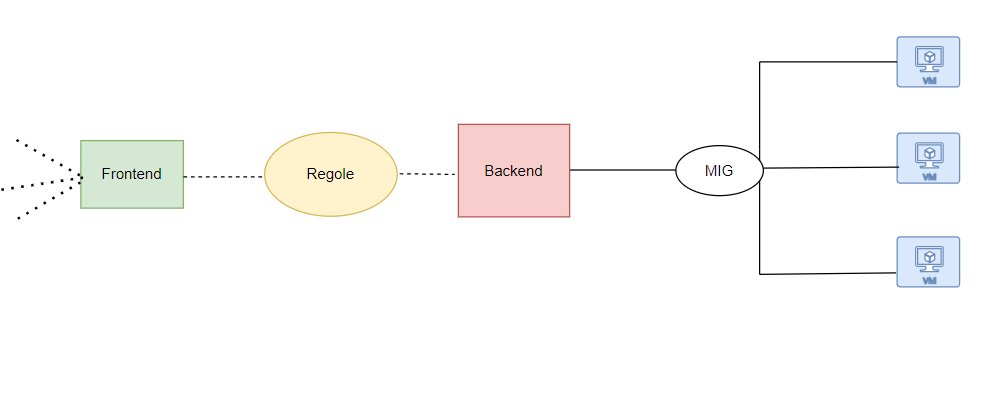

## Load Balancer

Lo trovo nella sezione riservata ai Network services

Solamente la tipologia UDP Load Balancing non consente il bilanciamento su istanze VM multi-region. E' solo single-region. Tutti le altre tipologie sì

Creo la tipologia per HTTPS in questo esempio, definendo se interno (lato VMs), o internet facing.

Dopodichè devo indicare il nome, il backend, host and path rules e il frontend

Quindi mittente (frontend) -> regole di smistamento traffico -> destinatario traffico (backend). 

Una volta creato posso effettuare delle chiamate, sul suo ip:port, ripetute per vedere come cambia l'istanza VM che mi risponde. Nell'esempio ogni istanza ha un server Http installato.

Quindi creo il backend service, a cui aggancio il MIG (pool di VMs uguali). Nella creazione del backend service posso flaggare CLOUD CDN, una cache per contenuti statici. Posso selezionare un health check.

