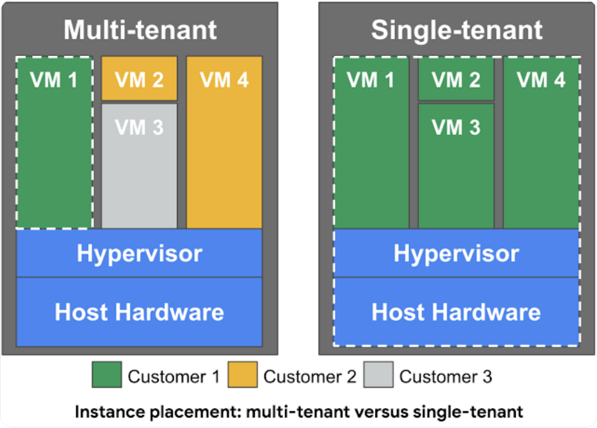

# Panoramica su Compute Engine, Instance Groups e Load Balancing

- [Compute Engine](#compute-engine)
- [Instance Groups](#instance-groups) 
- [Load Balancing](#google-cloud-load-balancing)

# Compute Engine Service 
 
Servizio che consente di creare e gestire macchine virtuali in GCP, Google Cloud Platform

- Consente di gestire auto scaling, per aumentare/diminuire il numero di instanze

- Consente di gestire il load balancing, quindi distribuire il carico

- Consente di collegarsi allo storage

### Demo

Obiettivo

Su GCP avviare una virtual machine tramite il servizio Compute Engine

Dopo averla avviata e smanettato un po' installando apache, vediamo che l'indirizzo IP interno (privato), non cambia se cambia lo stato della VM (stop, run). Se invece stoppo e faccio ripartire la VM quello esterno (pubblico) cambia.

IMPORTANTE

L'indirizzo esterno (pubblico) di default è infatti effimero, viene quindi riassegnato ad ogni modifica dello stato della VM.

Per averne uno fisso, occorre crearlo e collegarlo. **Static IP Address**. Ma questo anche quando non lo utilizzo lo pago. Anche se il nome può ingannare questo è pubblico, da non confondere con l'indirizzo statico privato

## STARTUP SCRIPT - INSTANCE TEMPLATE - CUSTOM IMAGE

Ho diverse opzioni per creare un'instanza di una VM e settere automaticamente delle configurazioni.  

### Startup script
 Nella creazione di un'istanza di VM, tramite Compute Engine, si va a definire nel campo che trovo in, MANAGEMENT-> SECURITY -> DISKS -> NETWORKING -> SOLE TENANCY, (potrebbe cambiare col tempo il front-end), lo script che voglio fare eseguire al bootstrap (Automation di Management) 

N.B 

Nell'utilizzo di script da utilizzare, ricordarsi il -y per le richieste di conferma

### Instance Template 

Permettono di definire un modello, in cui definisco tutte le caratteristiche che la mia macchina deve avere (compresi script ecc). E' molto più veloce.

Questo template consente di implementare singole VM o gruppi di VMs. 
Il limite maggiore è dato dall'immutabilità del template. Una volta definito il template è immutabile. Devo per forza crearne un altro.

N.B 
Nella crezione del template non va specificata Zone/Region. Ricordarsi inoltre di abilitare il traffico verso la Vm. Per il resto rimane uguale la procedura di creazione

Le istanze che vado a creare da questo template, costeranno in base al consumo. Durante la creazione dovrò specificare allora la Region e Zone.

Il nome della VM avrà la stessa radice del template seguito dal numero di creazione.

Sorge da queste due soluzioni un piccolo problema. Installare OS patches o software all'avvio della VM, chiaramente aumenta il tempo di boot.
La soluzione è definire una **Custom Image** con tutto il necessario già installato. 

### Custom Image

- Può essere condivisa su più progetti
- E' buona norma deprecare quelle vecchie
- Hardening, rispettare gli standard di sicurezza porta a creare VM "sicure"

Posso creare una VM utilizzando una Custom Image a partire da 
- Instance
- Persistence disk
- Snapshot
- File in Cloud Storage (un oggetto di GCP)

E' buona norma preferire le Custom Image alle Startup Script per una questione di velocità di avvio, nella seconda tipoligia devo scaricare pacchetti ogni volta.

Segue demo

[Demo Creazione Custom_Image](Demo\Demo_Creazione_VM_da_Custom_Image.md)

## Scontistiche di GCP
### Sustained use discounts -> sconti per utilizzo sostenuto

Vi sono degli sconti, applicati in automatico, in base all'uso delle VMs create tramite **Compute Engine, o Google Kubernetes Engine**

Non sono supportate alcune tipologie di macchine, come le E2 e A2

Non vengono applicati se le istanze sono state create con 
**[App Engine (flexible)](Modulo_5_Compute_Services.md\#app-engine-gae) e Dataflow**

### Committed Use Discounts -> sconti per workloads con uso predicibile

Per quei commit da 1 a 3 anni. Sconto fino al 70% in base al tipo di macchina e di risorse. Uno sconto superiore rispetto a quelli applicati in automatico, ma attenzione perché **non è possibile cancellare un commit**.

Per problemi con i commit occorre contattare Cloud Billing Support. Anche se è stato attivato per errore

Questa tipologia di scontistica si applica alle VMs create tramite Compute Engine, Google Kubernetes Engine

### Preemptible VM
Short-lived cheaper (fino al 80%) compute instances

Istanze con durata massima di 24 ore, che possono essere stoppate in qualsiasi momento da GCP, per esigenze proprie. 30 secondi prima un warning segnala l'interruzione della macchina, per salvare tutto

Limiti:
- Non sono sempre disponibili
- No SLA, non ho garanzie e tempi di downtime indefiniti
- No Automatic Restarts
- Non posso migrare una preemptible VM in regular VM
- Non è possibile utilizzare i crediti free per questa tipologia
- Le trovo nel form di creazione delle VM, Management -> availability policy

### Spot VM

Il concetto è uguale alle preemptible ma ho due differenze principali che le rendono più flessibili
- No maximum runtime di 24 ore (non ho questo limite)
- Dynamic pricing 60-91% discount

Le altre caratteristiche sono uguali

### Sole-Tenant Nodes

Di default singoli host possono contenere istanze di clienti diversi.

Un Sole-Tenant Node consente di avere hw dedicato
 

Casi d'uso:
- Security e compliance requirements: voglio avere VMs fisicamente separate da altri progetti
- High performance: aggrego fisicamente sullo stesso host
- Licensing: voglio usare per-core o per-processor "Bring your own licenses", per usare licenze già acquisite

Contro:
- Costi elevati, per via dell'hw dedicato

Per creare un sole-tenant node occorre creare un Node Group -> Node Group Template, in cui definisco Affinity Labels (key:in:value)

Nella creazione della VM poi inserisco queste Affinity Labels, campo sole-tenant, per associarle al Node Group

## Custom Machine Types

E' possibile implementare una VM custom. Tra quelle disponibile, questa opzione è presente per E2, N2 o N1

Il costo dipende dal numero di vCPUs e memoria richieste

A differenza delle altre non è una vera tipologia. E' una features di Compute Engine che consente di abilitare il flag custom nella configurazione della VM

## Costi associati alla Virtual Machine

Principalmente due costi:

- costi di infrastruttura per eseguire le VMs
- costi di licenza per OS (solo per premium images), non per OS open sources
    
    - opzioni:
        
        1. Pay-as-you-go model, pago in base all'uso
        2. (Con un sacco di limitazioni), usare le licenze esistenti o sottoscrizioni BYOS,BYOL (Bring your own subscription/licenses)

        La raccomandazione è quella di usare licenze esistenti quando possibile passando poi al pay-as-you-go model quando non più valide
        
Ripasso:
- Image: per avere dei modelli già pronti con OS e sw da voler usare per le VMs
    - riducono il tempo di boot e migliorano la sicurezza
    - è possibile condividerle con altri progetti

- Machine Types:
    - tipologie già settate (tot vCPU, tot Ram)
    - Custom Machine Types per usi diversi dall'ordinario

- Static IP Address: per avere ip pubblico fisso

- Instance Templates: template pre configurati, che semplificano la creazione delle VMs, tempo di boot maggiore rispetto alle image

- Sustained use discounts: sconti automatici per VMs running per molto nel mese

- Committed use discounts: sconti automatici per workloads il cui uso è previso da 1 a 3 anni. Non editabili

- Preemptible VMs
    - short-lived cheaper (fino a 80%): limite running 24 ore, stoppabili da GCP
    - spot: senza limite di running (no 24 ore)

- Sole-Tenant node: per hw dedicato. Stesso host per ogni VMs

## Instance Groups

Oggetto che consente di creare un gruppo di VMs, gestite come singola entità

Due tipologie:
- **Managed**: VMs identiche create usando un template (MIG)
    - features: autoscaling, auto healing, managed releases
    
    
- **Unmanaged**: VMs differenti
    - non offrono le features del MIG

    

    

Entrambe le due tipologie possono essere Zonal or Regional, posso creare nella stessa Zone, in Zones diverse, in Regions diverse (HA)

Vediamo le due tipologie nel dettaglio

### Managed Instance Gruops (MIG)
- identiche VMs create usando lo stesso instance template
- caratteristiche principali:
    - avere un certo numero stabilito di instanze -> se una fallisce viene ricreata
    - rilevare fallimenti, usando health checks (auto healing), e sopperire ad essi
    - aumentare o diminuire il numero di instanze in base al carico (auto scaling)
    - aggiungere un Load Balancer per distribuire il carico
    - creare le istanze in Zones diverse, o nella stessa zone. 
    - rilascio di nuove versioni senza downtime
        - rolling updates: rilascio nuova versione step-by-step. Gradualmente ne aggiorno una, poi un'altra ecc
        - canary deployment: testo una nuova versione su un gruppo ristretto di istanze prima di farlo sul gruppo intero (canarino miniere)

    (Regional MIGs >> Zonal MIGs, in termini di HA)  Il nome potrebbe ingannare  

    Zonal MIG -> singola zona

    Regional MIG -> diverse zone ma nella stessa Region 

Segue Link ->   [Creazione MIG](Demo/Demo_MIG.md)

## Google Cloud Load Balancing 

Servizio che distribuisce il traffico in VMs che si trovano in una o più Regions.
- Servizio gestito da Google Cloud
    - assicura quindi alta disponibilità
    - autoscale per gestire enorme carico
    - può essere public (verso internet), o private (interno)

- Tipologie
    - External (HTTPS) - Internal (HTTPS)
    - SSL Proxy - TCP Proxy
    - External Network TCP/UDP - Internal TCP/UDP

Segue Link ->  [Creazione Load Balancer](Demo/Demo_Load_Balancer.md)

