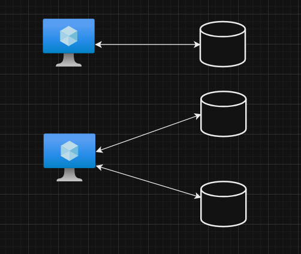
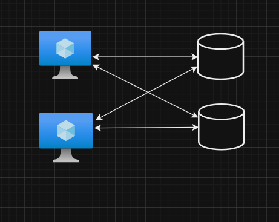
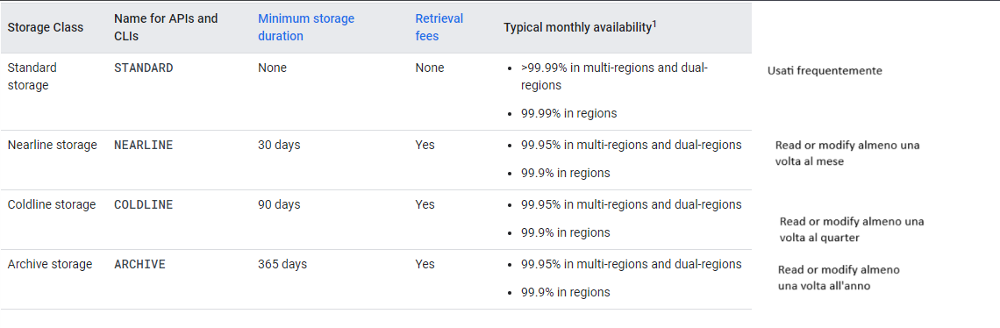
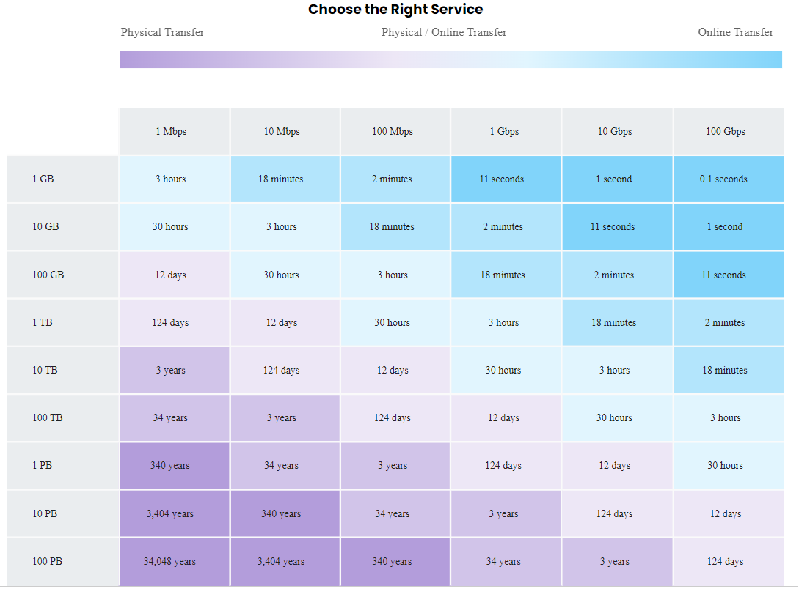

# Block, File and Object Storage in GCP 

Modalità di Storage in Google Cloud Platform

- [Block Storage](#block-storage)
    - [Persistent Disk](#block-storage)
    - [Local SSD ](#block-storage)
- [File Storage](#file-storage) 
    - [Block Storage](#file-storage)
- [Object Storage](#object-storage)
    - [Cloud Storage](#object-storage) 
    - [Riduzione costi su Object Storage](#object-lifecycle-management)
- [Trasferimento dati da on-premises al Cloud](#trasferimento-from-on-premises-to-cloud)

Vediamo le differenze principali tra i concetti di Block Storage e File Storage, per poi vedere i servizi presenti in GCP che si basano su questi concetti
# Block Storage
Caso d'uso, hard disk collegato ai pc

Tipicamente **un solo Block Storage** connesso ad **un solo virtual server**

**N.B**
Eccezione, solo Read Only Block devices possono essere connessi a più virtual server, alcuni cloud providers stanno provando anche quelli in scrittura

Tuttavia è possibile connettere **molteplici Block Storage** dispositivi ad **un virtual server**

Utilizzo di questo:
- Direct-attached storage (DAS) - simile ad hard disk
- Storage Area Network (SAN) - High-speed connecting ad un pool di storage devices

## **In GCP**
La prima opzione presente in GCP per Block Storage è 

 **Persistent Disks**: Block Storage sulla rete, è possibile connettere una Vm a questo tipo di dischi, presenti da qualche parte sulla rete. Il loro ciclo di vita non è legato a quella della VM
Di default ne abbiamo uno connesso alla VM quando la creiamo (Boot Disk da 10GB)

Sono molto flessibili: posso aumentarne la dimensione in base alle necessità. Le performance migliorano con la grandezza. Sono indipendenti dalla VM, come ciclo di vita (non sono effimeri). 
Due tipi di persistent disks: cambia il modo in cui i dati vengono replicati. Supportano gli snapshots. Come contro sono più lenti (network latency) rispetto ai Local SSDs

     - Zonal: Dati replicati in una singola zona
     - Regional: Dati replicati in molteplici zone, nella stessa Region. Tipicamente costo 2x rispetto Zonal
    
 **Local SSD**: Local Block Storage, collocato fisicamente sull'host che ospita la VM. Quindi velocità superiore. Tuttavia i dati archiviati su un'unità ssd locale rimangono finché l'istanza della Vm non viene arrestata o eliminata. Utilizzali quando hai bisogno di un disco temporaneo o di una cache rapida. I dati sono automaticamnete cifrati, ma è possibile configurare delle chiavi diverse. Non tutte le VMs supportano questo tipo di supporto.
Quindi Vantaggi: velocità
Contro: dati non persistenti, non supportano snapshots di conseguenza

Per avere maggiori performance è meglio scegliere Local SSDs molto capienti

Per approfondire su dimensioni e tipologia https://cloud.google.com/compute/docs/disks

 **N.B** 
 Di default, nella sezione Boot disk, alla creazione della VM, il tipo di disco dove vi è il Sistema Operativo, è un **persistent disk**
 I dischi addizionali possono essere aggiunti nella sezione Disks, scegliendo la dimensione. La tipologia Local SSD è disponibile solo per alcune tipologie di macchine

# File Storage

Una Enterprise necessita di un modo veloce per condividere files in modo sicuro e organizzato.

Questi files chiaramente sono condivisi su diversi virtual servers

Quindi tipicamente **tanti devices Block Storage** connessi ad **tanti virtual servers**

## **In GCP**
Per quanto riguarda i File Storage in GCP abbiamo:

 ## **Filestore**: Servizio di archiviazione files ad alte prestazioni  

**N.B** 
 Creo un oggetto Filestore, attivo le API, e ne creo un'istanza. 
 Scelgo la dimensione, la locazione e la tipologia, HDD, o SSD. Successivamente posso collegarlo ad una specifica VM 

 ## Object Storage

 Un contenitore di oggetti di ogni tipo, in cui definisco la frequenza di accesso a questi.

 
## **In GCP**
In GCP il servizio che svolge questa funzionalità si chiama **Cloud Storage**.

Cloud Storage è il più **popolare**, **flessibile** e **poco costoso** servizio di storage

- Archivia dati usando un approccio **chiave valore**
- Consente di definire il **controllo degli accessi** a livello di oggetto
- Fornisce **REST API** per l'accesso e la modifica sugli oggetti
- CLI ( **gsutil** ) & Client Libraries per l'accesso agli oggetti da parte di applicazioni scritte in (C++, C#, Java, Nide.js, PHP, Python, Rubi)
- **Store all file types**: text, binary, media files, application packages and logs, backup of your databases or storage devices, staging data during on-premise to cloud database migration

 **Cloud Storage**: Creo un **bucket**, un grande **contenitore di oggetti** di ogni tipologia. Definendo un bucket viene indicato il nome, che deve essere unico glabalmente (verrà poi utilizzato come url). 
 
 Indico la **Location**
 - **Region**, stessa Region
 - **Dual-Region** (due Region in America, Europa o Asia)  
 - **Multi-Regio** (in America, in Europa o in Asia). 
 
 Definisco poi lo **Storage class**, ovvero una classificazione per frequenza di accesso e "tempo di vita" del dato: 

- **Standard** , per **shot-term** storage, e **accesso frequente**
- **Nearline**, per **backups** e accesso **almeno una volta al mese**
- **Coldline**, per **disaste**r recovery e accesso **almeno una volta ogni quarter** 
- **Archive**, per **long-term** preservation dei dati e accesso **almeno una volta l'anno**

Posso definire questa per singolo oggetto, se non ne viene indicata una allora di default si applica quella del bucket

Una volta creato il **Bucket**, posizionandomi in esso posso fare drag and drop di ciò che voglio caricare

Class descriptions

- Unlimited storage with unlimited access.
- No minimum object size.
- Worldwide accessibility and worldwide storage locations.
- Low latency (time to first byte typically tens of milliseconds).
- High durability (99.999999999% annual durability).
- Redundant across regions if the data is stored in a multi-region or dual-region.
- A uniform experience with Cloud Storage features, security, tools, and APIs.

# Object Lifecycle Management 

E' possibile spostare un oggetto da uno storage class più caldo ad uno più freddo o addirittura eliminarlo, se vi è un match con delle regole che posso definire (age, created before ecc). Questo serve a limitare i costi principalmente. L'insieme di regole viene definito nella sezione Lifecycle del bucket. 

Quindi sono consentite le transazioni da:

- Standard to Nearline or Coldline or Archive
- Nearline to Coldline or Archive
- Coldline to Archive
- Deletion actions (delete)

# Trasferimento from On-premises-to-Cloud

Durante una migrazione, la tipica destinazione iniziale è **Google Cloud Storage**, da qui poi il passaggio alla destinazione definitiva 

Opzioni:

- Online Transfer: usando **gsutil** o API per trasferire dati verso GCP. 
    - Consigliata per trasferimenti singoli e inferiori ad 1 TB, anche in GCP stesso

- Storage Transfer Service: raccomandato per trasferimento online in large-scale (petabytes), da data centers privati o altri cloud providers, GCP stesso se da un bucket ad un altro.
    - Per eventi schedulati
    - Supporto a trasferimenti incrementali (per trasferimenti dei soli cambiamenti)
    - Affidabile e fault tolerant, continua da dove si era fermato in caso di errori

- Transfer Appliance: per trasferimento di una grossa mole di dati, richiesta fisica di storage in cui carico spedisco e invio a Google il quale li carica.

    E' possibile cifrare usando AES 256 o custom, i dati per la spedizione. Richiesta di dispositivi TA40 per trasferimenti di 40 tera, TA300 per 300 tera.
    - Raccomandato quando la dimensione supera i 20 TB
    - oppure
    - Il trasferimento online richiede più di 1 settimana

