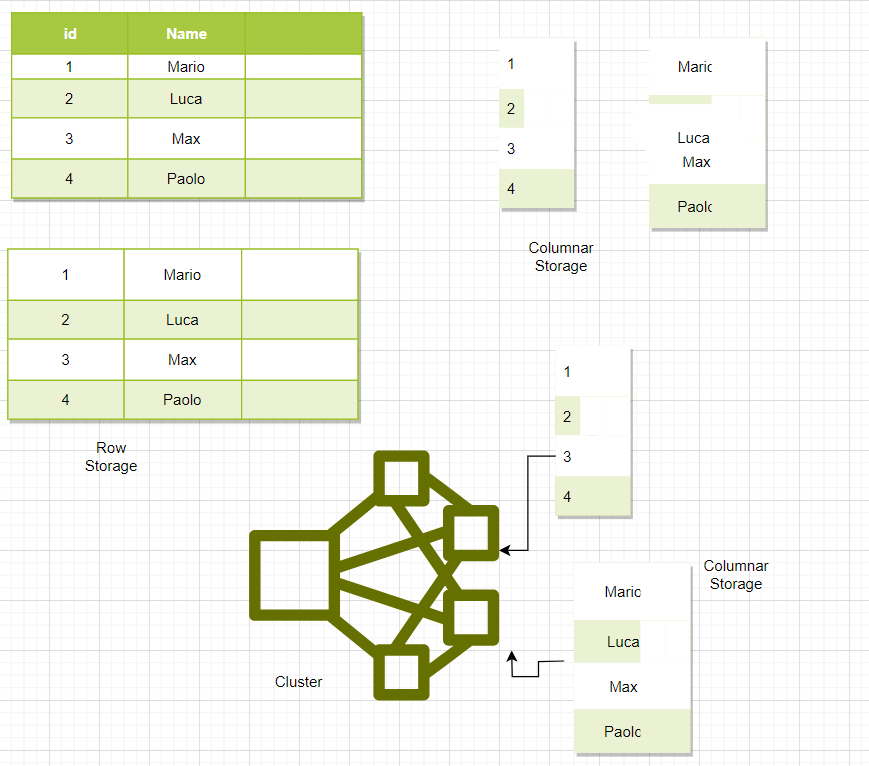

# Databases in Google Cloud

## Database Categorie

- [Relational (OLTP e OLAP)](#relational-db)
- [Document](#)
- [Key Value](#)
- [Graph](#)
- [In memory](#in-memory)

Nella scelta sicuramente influiscono **alcuni fattori**
- Schema fisso o flessibile
- Livello delle transazioni (atomicità e consistenza)
- Latenza (seconds, ms, micros)
- Quantità di transasizioni attese (centinaia, migliaia, milioni per secondi)
- Quantità di dati da archiviare (MB, GB, TB, PB)
- ecc

## Relational DB

Fino a poco tempo fa l'unica tipologia disponibile

- **Schema predefinito** con tabelle e relazioni
- **Strong transactional capabilities** (Posso effettuare cambiamenti nelle tabelle in una singola transazione, ma posso fare il commit, rendere effettive, solo quando l'aggiornamento va a buon fine su tutte le tabelle). Quindi un cambiamento si effettua su tutte oppure non va a buon fine 
- **Utilizzo**:
    - **OLTP** (Online Transaction Processing), quindi settore bancario 
    - **OLAP** (Online Analytics Processing), queries su una quantità di dati enorme 


## Relational Database - OLTP

Si utilizza quando un **grande numero di utenti** fanno **tantissime** di **piccole transazioni**

Questo significa che **pochi dati letti, aggiornati ed eliminati**

Casi d'uso:
- ERP, CRM, e-commerce, banking applications

I Databases popolari in questa area sono:
- MySQL, Oracle, SQL Server ecc

## In GCP, servizi gestiti per Relational DB
- **Cloud SQL**: supporta PostgreSQL, MySQL, SQL Server, per Regional relational databases (fino a pochi Terabytes). Quindi **"piccoli scenari"**
    - opzioni per backups, quando ecc
    - opzioni per read replicas
    - edit delle caratteristiche hw: ram,cpu, disco
    - opzione per automatic storage increases
    - indirizzo privato pubblico
    - enable point-in-time recovery, per creare dei punti di ripristino. Serve ad abbassare RPO (il quanto sono disposto a perdere)


- **Cloud Spanner**: 99.999% di disponibilità per applicazioni globali e unlimited scale (multipli di Petabytes)

     Quindi **"applicazioni globali"**


## Demo Cloud SQL, lista comandi utili 

Le istanze create sono completamente gestite. Non occorre preoccuparsi di aggiornamenti o altro, sono gestiti da Google. 

Creando un'istanza occorre scegliere che la tipologia di database: 
- MySQL
- PostgreSQL
- SQL Server

Dopodiché indico un'istance-id ed una password. Indico la Region e se single zone o multiple zone per maggiore HA.
Creata l'istanza, creo il database, indicando il nome. 
All'interno di esso potrò definire le tables.

Per lavorare con il database, devo connettermi all'istanza creata, ho diverse possibilità, scelgo tramite Cloud Shell.

```sql
- gcloud sql connect "nomeistanza" --user=root --quiet 

Chiaramente, come per gli altri servizi, occorre abilitare le sue API.

/*
Una volta loggato inserendo la password definita in precedenza, specifico che voglio utilizzare il database creato in precedenza con il comando
*/

- use "nomeDB"

/*
e creo all'interno una table, inserisco dei dati e ne visualizzo il contenuto
*/

- create table user (id integer, username varchar(30));
- insert into user values (10, 'Ferraro');
- describe user;      -- per avere una panoramica della table
- select * from user;    -- per estrapolare i records
```

## Demo Cloud Spanner, lista comandi utili 

In modo simile a Cloud SQL devo creare un'istanza, all'interno della quale vado a definire database.

Abbiamo detto che consente di creare database global, quindi posso scegliere se posizionare l'istanza in una singola Region o in multi-region. Successivamente occorre definire la compute capacity: questa determina la quantità di data throughput (capacità effettiva), queries per seconds e limite di storage. 

Definire 1 node equivale a 1000 processing units. Posso avere minimo 100 processing units. Chiaramente questo parametro incide sul costo.

Creo adesso un database, all'interno del quale posso definire le mie tables. Viene prepopolato un template in cui definisco il mio schema

La gestione dei dati e delle queries avviene tramite GUI e templates.

Ritornando nella Overview è possibile osservare opzioni per import/export data verso Cloud Storage bucket or folder     

E' possibile definire backups e restore, visualizzare metriche ecc.

Solitamente Cloud Spanner è una tipologia di servizio costosa


## Relational Database - OLAP (Online Analytics Processing)

Consente di **analizzare petabytes di dati**

Casi d'uso: reporting applications, data warehouse, business intelligence applications ecc

## In GCP, servizio gestito per Relational DB OLAP

- **BigQuery**: Petabyte-scale distributed data warehouse 


Il salvataggio per colonne (OLAP) su diversi nodi di un cluster consente di avere molta più efficienza rispetto a quello per righe (OLTP). 

Le colonne contengono dati simili, quindi è possibile comprimere i dati. Inoltre salvando le colonne su nodi diversi ho maggiore velocità di lettura e scrittura.



---
# NoSQL Databases

- Not only SQL
- Schema flessibile

## In GCP, servizi gestiti 
- **Cloud Firestore (ex Datastore)**: Managed serverless NoSQL documents database

  Progettato per transazioni di applicazioni mobile e web

  Raccomandato per piccoli e medi databases (0 fino a pochi Terabytes)
  - **Firestore** è la nuova versione di **Datastore**, a cui aggiunge:
  - Consistenza maggiore
  - Mobile e Web client libraries
  - **"Piccoli scenari"**


- **Cloud BigTable**: Managed, scalable NoSQL wide column database
    - Not serverless (quindi occorre creare instances prima di creare tables)
    - Raccomandato per data size da 10 Terabytes fino a diversi Petabytes
    - **"Grandi scenari"**


## Demo Cloud Firestore, lista comandi utili 
Seleziono la modalità Native o Datastore (per sistemi legacy)

N.B * *non è possibile cambiare in seguito**

Possibilità di scegliere tra Regional o Multi-region come location del servizio

All'interno è possibile definire delle Collection, ovvero contenitori, di Document e Collection.
Ogni Document è costituito da un Id, (assegnato in automatico altrimenti se non specificato) anche per la Collection ne occorre uno, successivamente definisco il nome del campo, il tipo del valore e il valore del campo.

E' possibile definire all'interno di un Document una Collection con Document vari al suo interno. Quindi ho una struttura gerarchica 

Posso definire degli Indexes per poter effettuare queries su diversi campi allo stesso tempo

Posso filtrare i miei dati in output, in modo molto specifico (description=="ciao"), questo facilita la ricerca nella Collection.


Esiste la possibilità di import/export data da e verso Google Cloud Storage, quindi definisco cosa e il bucket che voglio selezionare


Definire Collection(collezione di Document/Collection) e Document (campo-valore), visione gerarchica, un Document può contenere anche Collection. Definire indexes per facilitare la ricerca, possibilità di filtraggio dei dati e di import/export su bucket di Google Cloud Storage

---
# In-memory  Databases

- Recuperare dati dalla memoria è molto più veloce rispetto al disco 
- Redis è un esempio supportato

## In GCP, servizi gestiti 
- **Memory Store**

Si utilizza per caching, session management, gaming leader boars (classifiche real time), applicazioni geospaziali

