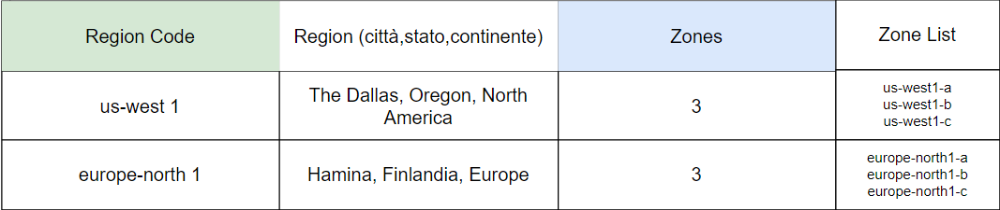

# Google Cloud Platform (GCP)

Piattaforma Cloud gestita da Google che mette a disposizione oltre 200 services

# Cos'è il Cloud e perché ne abbiamo bisogno

Prima del cloud,  i picchi di richieste imponevano acquisti e predisposizioni preventive. Di conseguenza

- Costi, non sempre sostenibili (es. startup)
- Sovradimensionamento nei periodi "morti"

Il cloud permette di ottenere risorse on-demand (su richiesta)
- quando servono
- pagando per quello che uso
- senza costi per la manutenzione dell'infrastruttura
- diventando globale in pochi minuti

I principali attori in questo mondo, quindi i maggiori cloud providers sono: Amazon, Microsoft, Google (in ordine di porzione di mercato)

E' possibile fare una prova di tutte le piattaforme, in particolare per Google Cloud Platform, la prova concende 300$ di crediti e l'uso di oltre 20 servizi.

# Zones & Regions
Alcuni termini che ritroviamo spesso, che cambiano di poco, in termini numerici, in base al cloud provider.
Perchè sono necessari i concetti di Zone e Region

- low latency: vogliamo fare in modo che utenti dislocati in parti del mondo diverse, accedano ai servizi in tempi rapidi. Come? Erogando il servizio in Regions diverse
    - In questo modo, gli utenti vicini ad una Region accedono a quella
    - Se un datacenter va giù ne ho un altro nella stessa Region
    - Se l'intera Region non è disponibile, continuo ad erogare da altre

- high availability (HA): vogliamo rendere molto disponibile il nostro servizio. Come? Erogandolo in Zones diverse

## Region
Ad oggi ci sono 38 Regions in GCP. Ogni Region dispone di almeno 3 Zones, almeno.

Rappresenta quindi un'area che ospita le tue applicazioni.

Le Zones nella stessa Region sono connesse a bassissima latenza. 

## Zone
Ad oggi 115 Zones. Una Zone è un datacenter. Ogni Zone dispone di almeno 1 cluster, insieme di risorse hosted in un datacenter. 

