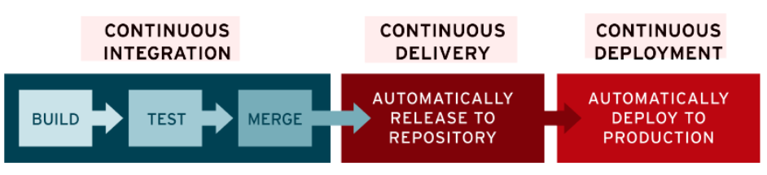
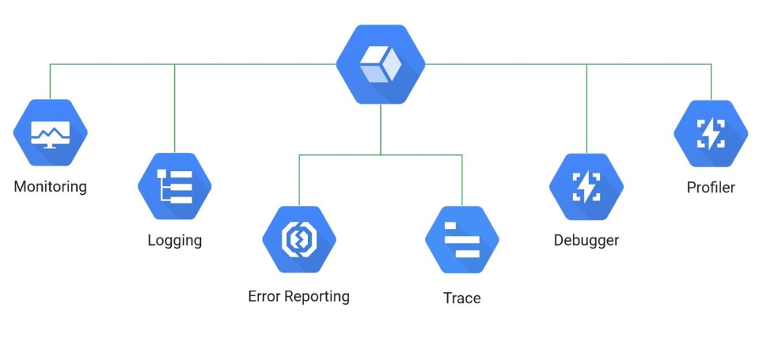

# DevOps

Racchiudere gli elementi dei migliori Teams per un buon software

 (Teams: business, development, operations)
- **Feedback**, prima si trova un problema, prima si risolve.
- **Comunicazione**, per lavorare bene insieme, è necessaria
- **Automation**, su task ripetitivi e noiosi per concentrarsi nella parte creativa

## CI/CD Tools in GCP

L'acronimo "CI" in CI/CD sta per integrazione continua. Con l'integrazione continua, le nuove modifiche apportate al codice dell'app vengono regolarmente compilate, testate e unite in un repository condiviso, risolvendo così il problema dei conflitti tra le numerose diramazioni di un'applicazione in fase di sviluppo.

L'acronimo "CD" in CI/CD può far riferimento al deployment continuo o alla distribuzione continua, e indica le modalità per automatizzare le fasi successive della pipeline.

Benché siano concetti strettamente correlati, deployment continuo e distribuzione continua vengono a volte utilizzati in modo distinto per specificare come avviene l'automazione.

Con distribuzione continua si intende in genere il processo con il quale le modifiche apportate da un team di sviluppo all'applicazione vengono automaticamente testate alla ricerca di bug e caricate in un repository (Github o simili)

Il deployment continuo, invece, fa riferimento ad alcuni ulteriori passaggi relativi al processo di rilascio del nuovo software. In genere prevedere il rilascio automatico delle modifiche apportate dallo sviluppatore dal repository alla produzione, dove diventano fruibili ai client

[Link a Red Hat](https://www.redhat.com/it/topics/devops/what-is-continuous-delivery)

- Cloud Source Repositories: repository privato, simile a Github
- Container Registry: per archiviare Docker images
- Jenkins: aiuta a costruire e testare il tuo prodotto continuamente, in modo da poter integrare facilmente le modifiche nella build
- Cloud Build: per realizzare degli artifatti (jars o immagini docker) dal codice sorgente
- Spinnaker: consente di fare multi-cloud continuous delivery

Esempio: Cloud Run con Cloud Build

Cloud Build per automatizzare l'intero processo

Step 1: Creo un repository in Cloud Source Repository, il codice sorgente virnr qui archiviato, ogni cambiamento viene rilevato da Cloud Build

Step 2: A partire dal source code faccio una build per ottenere una Docker image

Step 3: Archivio la Docker image in Container Registry 

Step 4: Deploy la Docker image in Cloud Run 

## Infrastructure as Code (IaC)

Trattare l'infrastruttura allo stesso modo del codice. In questo modo si tiene traccia dei cambiamenti apportati, si evitano errori legati alla configurazione manuale.

Due argomenti chiave:

- Infrastructure Provisioning
    - Allocare potenza di calcolo, database, storage e networking
    - Terraform (open source e cloud neutral) oppure GCP offre Google Cloud Deployment Manager per farlo

- Configuration Management
    - Installare il giusto software e tools sulle risorse allocate, in modo automatizato (ho 100 VMs non devo farlo su ognuna)
    - Open source tools per farlo sono Chef, Puppet, Ansible e SaltStack 

La fase operativa prevede la manutenzione, il monitoraggio e la risoluzione dei problemi delle operazioni negli ambienti di produzione.

Strumenti a disposizione per il team Operations su GCP

 - Monitoring: metriche e alerts, consumo di CPU ecc
 - Logging: Logging centralizzato di tutte le applicazioni
 - Audit Logs *: per aver un controllo su chi ha fatto cosa (tizio ha avviato la VM)
 - Trace: per tenere traccia delle singole richieste che attraversano i microservizi 
 - Debugger: per effettuare un debug live nell'environment (dev/prod ecc)
 - Profiler: per andare in profondità, per esempio di un microservizio nello specifico
 - Error Reporting: per visuallizzare le exceptions lanciate dalle applicazioni  

**non presente nell'immagine*
## SRE
**Il site reliability engineering (SRE) è un approccio alle operazioni IT basato sull'ingegneria del software**, che prevede l'uso di software per la gestione dei sistemi da parte dei team, oltre all'automazione di tali operazioni.

**L'approccio SRE aiuta i team a trovare il giusto equilibrio tra rilasciare nuove funzionalità e garantire affidabilità agli utenti.**

**I teams SRE determinano il lancio delle nuove funzionalità, applicando accordi sul livello di servizio** (SLA, Service-Level Agreement) per stabilire l'affidabilità richiesta di un sistema, che viene misurata tramite indicatori del livello del servizio (SLI, Service-Level Indicator) e obiettivi del livello di servizio (SLO, Service-Level Objective). 

DevOps è un approccio alla cultura, all'automazione e alla progettazione di piattaforme pensato per offrire all'azienda valore e reattività maggiori attraverso un'erogazione dei servizi efficiente e di qualità elevata. **Possiamo considerare la metodologia SRE come un'implementazione di DevOps.**

I teams SRE si focalizzano su ogni aspetto di un'applicazione, quali disponibilità, latenza, performance, efficienza, monitoraggio, capacità di pianificazione, risposte di emergenza. Automatizzare, riducendo la fatica e move fast by reducing cost of failure (se un problema in produzione implica molto tempo per la risoluzione, tra ricerca e fix, allora gli aggiornamenti saranno sporadici e delicati. Introducendo invece piccoli aggiornamenti e di frequente allora migliora le cose). 

Il tutto rispettando delle specifiche di efficienza della fornitura del servizio.
Come sapere se un servizio funziona bene o se rispetta le richieste?

- SLI (Service Level Indicator): Misure quantitative di un aspetto su un servizio, quali disponibilità, latenza, throughput ecc. Tipicamente misure aggregate "su 1 anno", "su 1 minuto" ecc

- SLO (Service Level Objective): SLI + target
    - 99,99% Availability ecc
    - Response time: 99th percentile-1 second (il 99% delle richieste deve rispondere entro 1 secondo) 
    - La loro definizione non è semplice
    - Sono interni

- SLA (Service Level Agreement): SLO + conseguenze
    - Contratto
    - Cosa succede se non rispettato uno SLO (definito nel contratto)
    - Tipicamente avere SLO interni più stringenti di quelli indicati nello SLA
    - Sono esterni (con i clienti)
- Error bugets: (100% meno SLO)
    - Serve a capire se si sta andando troppo veloce nei rilasci.
    - Se si rispettano gli SLO allora si può procedere più velocemente

Alcune best Practices dietro SRE
- Handling Excess Load
    - Definire dei limiti sulle API, con differenti SLA in base ai clienti
    - Riduzione del QOS (restituendo contenuti statici)
- Evitare Fallimenti in cascata
    - se un microservizio è sovraccarico, attendere prima di bombardarlo per evitare di farlo fallire
- Prevedere Penetration Test (Ethical Hacking), simulando attacchi per trovare vulnerabilità
- Load Testing (JMeter, LoadRunner, Locust), per simulare traffico reale e testare picchi di traffico
- Resilience Testing, per testare l'applicazione sotto stress
    - Chaos Testing, interrompendo un layer alla volta (monkey with a weapon)
    - includere test sulla rete, cosa succede se internet va giù
    - Programma Google DiRT - disaster recovery testing at Google. Disconnettere il data center e vedere come rispondono le applicazioni. Un sistema può essere progettato per tollerare i guasti, ma occorre testarlo in modo esplicito

[Link a Red Hat](https://www.redhat.com/en/topics/devops/what-is-sre)

## Da monolite a microservizi

Se vi è la voglia, e necessità di andare verso il cloud, occorre tenere conto di alcune considerazioni

- Preferire Managed Services: non creare manualmente VMs, gestire il ciclo di vita ecc
- Preferire Containers e Orchestratori: GKE consente di utilizzare in modo facile K8s su GCP. Se Kubernetes è on-premises allora Anthos consente di gestire il cluster   
- Preferire Stateless, Horizontally Scalable Microservices: (datastore o firestore se si vuole salvare lo stato)
- Usare automazione: Cloud rende (DevOps, SRE - CI/CD) molto più facili
- Usa un approccio step-by-step. Sperimenta

 

