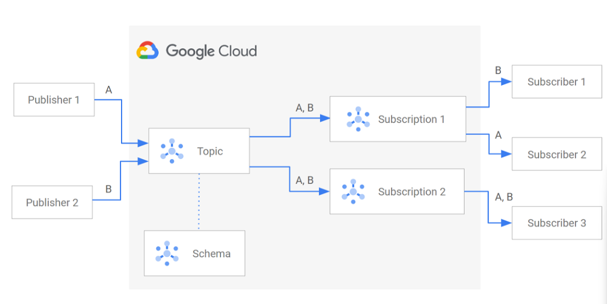
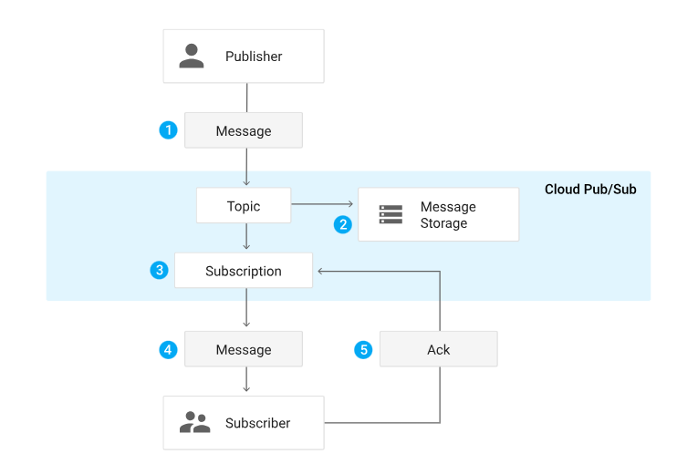

# Comunicazione asincrona e repository privati
- Pub/Sub
- Container Registry
- Artifact Registry

Spesso è utile utilizzare un modello di comunicazione diverso da quello sincrono bloccante, per essere disaccoppiati

# Google Cloud Pub/Sub
In questo servizio ho tre entità: publisher-topic-subscriber 

Occorre definire un topic dove uno o più publisher(applicazione) pubblicano i messaggi, il o i subscriber (applicazione) li ricevevono

Vantaggi:
- Disaccoppiamento: Al publisher non importa se qualcuno (subscriber) sta in ascolto
- Disponibilità: Il publisher può pubblicare anche se il subscriber è giù
- Scalabilità: E' possibile aumentare le risorse al crescere del traffico
- Durabilità: I messaggi non vengono persi se il subscriber non può riceverli, ma depositati nel topic

Questa soluzione è importantissima nei sevizi in cui si generano moltissimi messaggi, low cost (pay for use)

Due tipologie di subscription (iscrizioni in ricezione al topic):

    - Push: il topic invia automaticamente i messaggi ai subscribers (HTTPS POST)
    - Pull: il subscriber effettua una richiesta HTTPS per la ricezione dei messaggi (ci sono dei messaggi ?)

Relazioni pub/sub: 1 a N, N a 1, N a N

Entrando più nel dettaglio di funzionamento, è utile fare attenzione ad alcune particolarità. Vediamo gli steps da eseguire
- Step 1: Creare il Topic
- Step 2: Creare le Subscriptions (anche una è possibile)
- Step 3: Subscriber si registrano al topic (tramite la subscription). 
**Importante**
    - diversi clienti (subscribers) registrati alla stessa subscription -> i messaggi vengono splittati (ho 3 clienti connessi alla stessa subscription e  4 messaggi nel topic, non tutti ricevono i 4 messaggi)
    - diversi clienti (subscribers) registrati a subscriptions diverse -> tutti ricevono tutti i messaggi(ho 3 clienti connessi a 3 subscriptions diverse, tutti ricevono tutti i messaggi dal topic) 
- Step 4:
    - Una volta processato il messaggio, il subscriber invia un acknowledgement al topic.
    - Il messaggio viene eliminato dalla coda dei messaggi
N.B 

Ogni Subscription rappresenta un canale discreto (se ho 3 subscriptions tutti i messaggi passano per le 3 subscriptions)

Questo modello è utilizzato con le architetture a microservizi, IOT e streaming
Segue Link ->   [Creazione Pub/Sub](Demo/Demo_Pub_Sub.md)

# Container Registry e Artifact Registry

Se voglio archiviare qualche immagine ho due opzioni, la seconda è da preferire 

- Container Registry (desueta): usa GCS bucket per archiviare immagini docker. Un docker hub ma privato, opzione un po' desueta. 
    
    - Gestione permessi su IAM di GCS buckets
       
    - Solo immagini Docker

- Artifact Registry (da preferire): consente di archiviare non solo immagini docker. Posso definire la location, etichette e decidere come gestire una chiave di cifratura. E' l'opzione da preferire. 
    - Per la gestione dei permessi esistono Artifact Registry Roles:
        - Artifact Registry Reader
        - Artifact Registry Writer
        - Artifact Registry Administrator ecc
        
         Ma è possibile essere più granulari e agire sul singolo repository
       
     - Diversi formati supportati