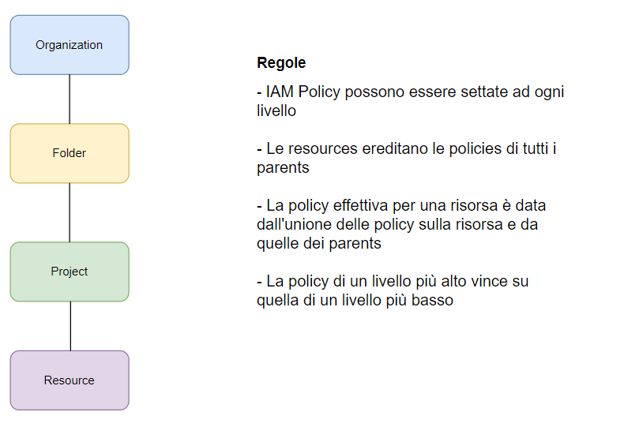

# Cloud IAM e Identity Platform e Organization Policy Service

**Identity and Access Management**

Tipicamente nel cloud abbiamo **resources** (virtual server, databases ecc) e **identities** (human e non-human, come un'applicazione) che devono accedere alle risorse ed eseguire operazioni.

 **Come identificare utenti nel cloud, come configurare le risorse sulle quali possono accedere e come configurare le azioni concesse?**

 ## IN GCP: Cloud IAM permette di rispondere a queste domande
- **Autenticazione** (é l'utente corretto?)
- **Autorizzazione** (ha i permessi per farlo?)
- **Identities** che possono essere:
    - Un GCP User (Google Account or Externally Authenticated User)  
    - Un Group di GCP Users (sempre consigliati per facilità)  
    - Un applicazione in esecuzione in GCP User 
    - Un applicazione in esecuzione on premise 
    - Uno User non autenticato

Fornisce un **controllo molto granulare**:
- Limitando un singolo utente a:
    - per eseguire una singola azione
    - su di una risorsa cloud
    - da un indirizzo IP specifico
    - durante una finestra temporale specifica

Terminologia
- [Roles](#roles) : insieme di permessi su risorse. Ne esistono alcuni predefiniti (Diverso dal concetto Roles in AWS) 
- [Policy](#policy) : per assegnare (or bind) un ruolo ad un membro

 ## Roles 
 **Roles sono permessi**: un insieme di azioni su un insieme di risorse
 
 Tre tipologie:
 
- **Basic Roles** (or Primitive roles): Owner/Editor/Viewer
    - Viewer (roles.viewer) - Read only actions
    - Editor (roles.editor) - Read + Edit actions
    - Owner (roles.owner) - Editor + Manage roles and Permissions + Billing

    **N.B non consigliati in produzione, sono troppo larghi**

- **Predifined Roles** - molto granulari e gestiti da Google

    -   Es. Storage Admin (può creare buckets anche), Storage Object Admin (non può crearli), Storage Object Viewer, Storage Object Creator

- **Custom Roles**: quando gli altri non sono sufficienti

## Regole di precedenza sulle IAM policies
 


## In GCP 
Ricercando la voce **IAM & Admin** 

Un Member è anche chiamato Principal o Identity, **è possibile visualizzare i Roles a lui assegnati**. E' possibile aggiungerne uno nuovo, creandolo, o editarne uno già presente.

La voce del menù a sinistra **Policy Troubleshooter**, consente di capire se ci sono problemi con gli accessi su una risorsa in base al ruolo.
Se un certo principal, su una specifica risorsa, ha un certo tipo di permesso

**SERVICE ACCOUNTS**

 Sono creati per **concedere l'accesso alle applicazioni** che vogliono accedere ai servizi su GCP. 
 
 Sono identificati da un indirizzo email 
 
 (Es. id-compute@developer.gserviceaccount.com).
- La voce è presente sempre in IAM & Admin.
- Alcuni sono creati in automatico alla creazione di un servizio
- No password, ma public e private RSA key pair

Tipologie:
- **Default service account** creati in automatico quando qualche servizio viene creato. Tuttavia il loro uso è sconsigliato per via del Role Editor (troppo largo)

- **User Managed** creati dall'utente. **RACCOMANDATO**, definisco il nome e il Role. Quando poi vado a creare una nuova risorsa posso associarlo ad essa. Le condition servono ad essere ancora più specifici (tempo o tipo risorsa, fine validità ecc).
        
        MOLTO RACCOMANDATO

        N.B Quando creo una VM posso fare il bind con il service account creato ad hoc per poter far sì che le sue applicazioni possano accedere a servizi su GCP (come cloud storage ad esempio) 

        Nella creazione, bisogna dire chi ha accesso a questo service account, users role per poter fare il bind o admin role per gestirla

- **Google-managed service account** creati e gestiti da Google, ma poco usati


# Demo, creazione di un service account
Idea: creazione service account da associare ad una vm, attraverso la vm creo un bucket su Google Cloud Storage

Creo prima un service account in cui definisco come Role Compute Instance Admin (quindi full control of Compute Engine instance resources, posso creare vm), (manca il permesso sullo storage, quindi mi aspetto un errore). Successivamente durante la creazione della vm, associo questo service account alla vm, accendo la vm, mi collego tramite ssh, ed eseguo un comando per creare un bucket (deve avere un nome unico globalmente), che fallirà perchè non ho i permessi associati.

```bash
gsutil mb gs://bucket-ofvins         # mb sta per make bucket
```

 Vado quindi in GCP, sezione IAM di IAM & Admin, per editare il service account creato. Gli aggiungo il Role Storage Admin (per avere il full control sulle risorse GCS). La modifica è instantanea, quindi rieseguendo il comando verrà creato il bucket su GCS, visualizzabile da STORAGE su GCP


 ## IAM Best Practices
 - **Principio del minimo privilegio**: Concedi sempre i minimi privileggi necessari per un role. 
    Per questo motivo Basic Roles non sono raccomandati, meglio i predefined roles
- **Utilizza Service Accounts con privilegi minimi**

- **Separazione dei doveri**: includi almeno 2 persone in tasks sensibili. Ad esempio App Engine fornisce App Engine Deployer e App Engine Service Admin roles
    - Il primo può rilasciare una nuova versione ma non cambiare il traffico
    - Il secondo può cambiare il traffico ma non rilasciare una nuova versione

- **Monitoraggio continuo**: Cloud Audit Logs per controllare cambiamenti e accessi
- **Utilizzare Groups** quando possibile: facilita la gestione

# User Identity Management in Google Cloud
Se utilizzo una mail per creare un free trial account, ad esempio, allora viene creato un utente "Super Admin", ovvero che ha role owner connesso, quindi ha accesso completo e può gestire l'accesso di altri utenti mediante i loro Gmail accounts.

Tuttavia usare i Gmail accounts per una enterprise non è il massimo.

Esistono **due altre modalità**

- Opzione 1: L' azienda sta già usando Google Workspace (G Suite), per far usare i tools di Google ai propri dipendenti.
    - E' possibile usare l'account associato per gestire anche utenti (gruppi ecc). Per farlo basta collegare Google Cloud Organization con Google Workspace

- Opzione 2: L'azienda sta usando un **Identity Provider** (come AD, o Azure Ad)
    - Federate Google Cloud con l'Identity Provider (Corporate Directory Federation)

    Corporate Directory Federation consente di collegare Cloud Identity o Google Workspace con un external Identity Provider, come Active Directory o Azure AD.

    Cloud Identity è una piattaforma unificata per la gestione delle identità. Quindi gestisce identities. Quindi se abilito la risorsa Identity Platform in GCP, posso configurare diversi Identity Provider (anche esterni), configurare MFA ecc. Per farlo ad esempio con Active Directory di Microsoft devo utlizzare SAML

    Consente di abilitare il **Single Sign On**: in questo modo autenticandosi, saranno anche autenticati al loro account Google Cloud Platform

    **Identity Platform**: consente di gestire identità deo clinti e controllo accessi

    **Differenze tra: Cloud IAM e Identity Platform**
    -   **Cloud IAM**: Per autorizzazioni su dipendenti e Partners

                   Controllo sull'accesso alle risorse create su GCP: Member, Roles, Policy e Service Accounts
    
    - **Identity Platform**: Customer identity and access management (CIAM)

        - **Autenticazione e autorizzazione per gli utenti delle tue applicazioni e servizi**

        - Web & mobile apps (iOS, Android)
        - **Molteplici metodi di autenticazione** (SAML, OIDC, email/password, phone, social ecc)
        - Features: User sign-up (registrazione) e sign-in (accesso), **MFA** ecc
         - Rappresenta un upgrade del servizio legacy Firebase Authentication
         - Si integra molto bene con Identity-Aware Proxy (per Cloud Run ecc)
    
**Scenari di utilizzo**
- Un applicazione su GCE VM necessita l'accesso al cloud storage?       
 Cloud IAM -> Service Account
- Un utente di un'azienda vuole caricare oggetti su Cloud Storage buckets? 
Cloud IAM
- Voglio gestire end users per una mia aplicazione (web, ecc)?                
Identity Platform   
- Voglio abilitare il Login tramite facebook per la mia applicazione?   
Identity Platform
- Voglio creare registrazione e accesso utente per la mia applicazione ? 
Identity Platform


# Organization Policy Service

Servizio che consente di definire dei ***vincoli centralizzati** alle risorse create in un Organization. Le trovo in IAM & Admin

Es. Voglio disabilitare la creazione di Service Accounts
    Permettere/negare la creazione di risorse in una specifica regions

Per crearle occorre avere Role: Organization Policy Administrator

Occorre ricordare che **IAM** si focalizza su Who
    - chi può fare una specifica azione sulle risorse?

**Organization Policy** si focalizza su What
    - cosa può essere fatto su specifiche risorse?

        N.B Le Organization Policies sono prioritarie sulle IAM. Quindi se vi è il divieto di creare risorse, l'utente anche se potrebbe farlo, non lo potrà fare

**Ne esistono un sacco predefinite già**


Note

N.B Per le immagini, il path qui presente utilizza il forwardslash, windows utilizza il backslash. Se non vengono visualizzate il problema potrebbe essere legato a quello