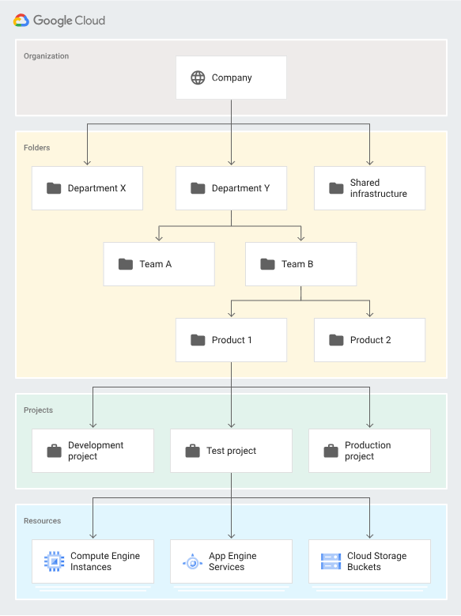

# Organizzazione Google Cloud Platform Resources

- [Organization](#organization)
- [Folder](#folder)
- [Project](#project)
- [Resources](#resources)
- [Billing Accounts](#billing-accounts)

## Organization
Un' organization può contenere diverse folders
## Folder
Una folder fa parte di un'organization. 

    Regola di base: Folders diverse per dipartimenti diversi. Questo consente di creare completo isolamento tra stesso ambiente ma su dipartimenti diversi. Applicazioni produzione di un dipartimento da quelle di un altro dipartimento

    Creare poi shared folder per shared resources
## Project
Un project è creato all'interno di una folder. Un project serve a raggruppare differenti risorse. Una folder può contenere diversi projects

    Regole di base: Projects diversi per ambienti diversi. Questo consente di creare completo isolamento tra ambiente di test e di produzione ad esempio

## Resource
La risorsa è creata all'interno di un project. Un Project può contenere diverse resources

Es. Considera due applicazioni "A1","A2"
    Due ambienti: "DEV" e "PROD"
    In un mondo ideale occorre creare 4 progetti: A1-DEV, A1-PROD, A2-DEV, A2-PROD

    N.B  Se seleziono in GCP il progetto e vado su ALL, posso visualizzare l'intera gerarchia. Nella versione free trial non posso avere Organization e Folder.

## Billing Accounts

Un account per il pagamento è obbligatorio per creare risorse in un progetto.
- Contiene i dettagli del pagamento
- Ogni progetto con risorse atttive dovrebbe essere associato ad un Billing Account

Un Billing Account può essere associato quindi ad uno o più progetti

    Una startup dovrebbe avere un solo Billing Account
    Una enterprise può averne diversi per ogni dipartimento

Due tipologie:
- Self Serve: pagamento con Credit Card o Bank Account
- Invoiced: genera fatture (usato per enterprise)

E' importante definire dei Billing Budget per evitare sorprese, e definire degli Alerts.
Le soglie di alert di default sono a 50%, 90% e 100%

E' possibile espostare i dati di fatturazione verso:
- Big Query (per visualizzare meglio)
- Cloud Storage (per archiviare)

Note

N.B Per le immagini, il path qui presente utilizza il forwardslash, windows utilizza il backslash. Se non vengono visualizzate il problema potrebbe essere legato a quello